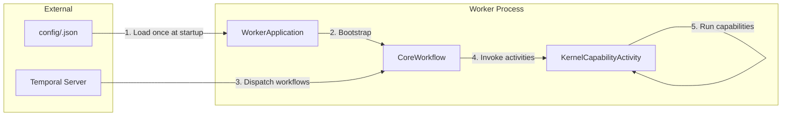
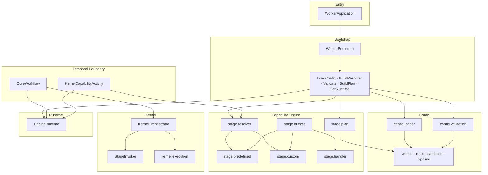
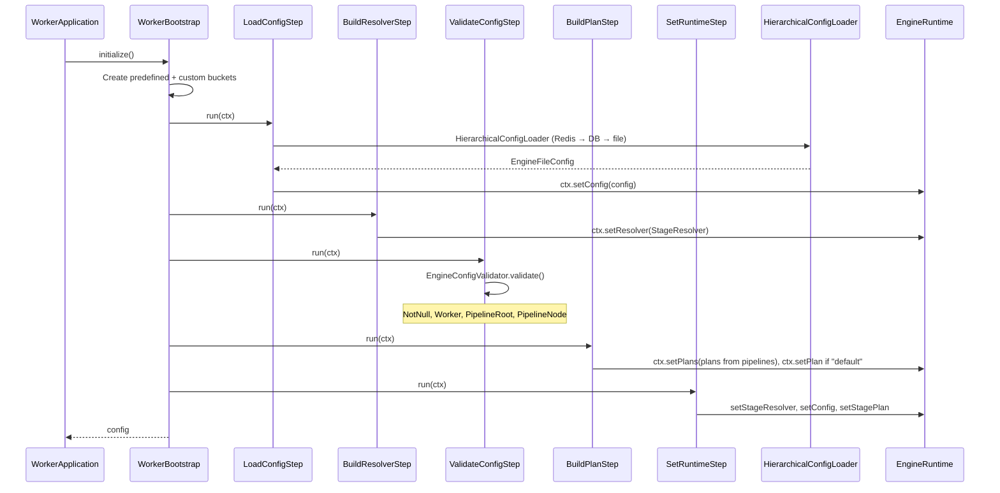
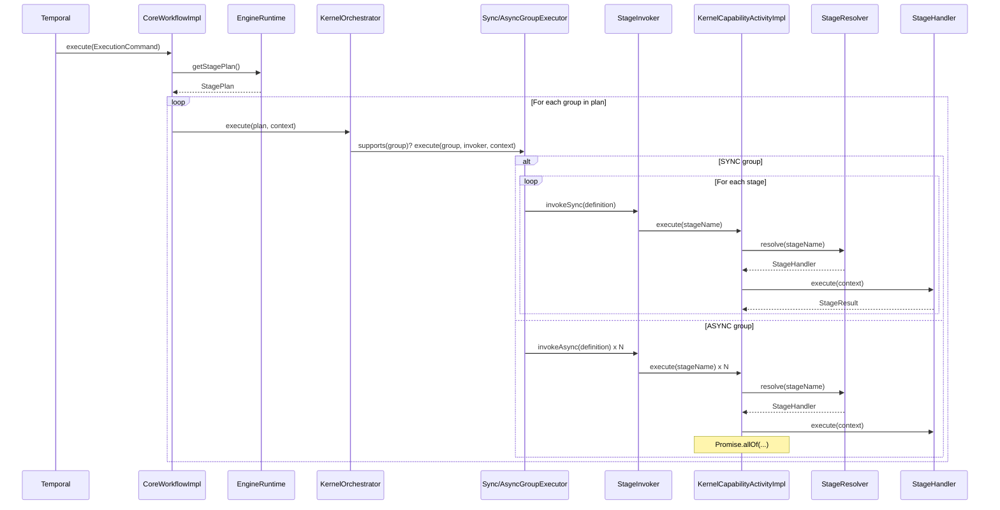
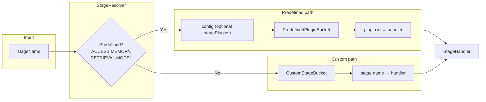
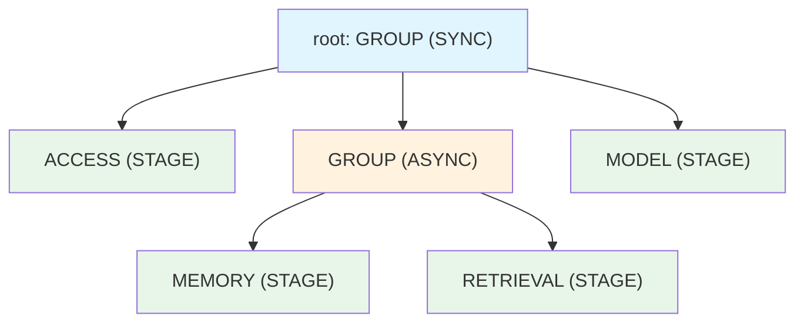

<!-- Copyright 2026 Open LLM Orchestrator contributors. Licensed under the Apache License, Version 2.0; see LICENSE file. -->

# Open LLM Orchestrator Worker — Architecture

High-level architecture and package layout for the worker engine.

---

## 1. System Context

- **Temporal** drives workflows and activities.
- **Config** is loaded once at bootstrap in order **Redis → DB → file**. File path is **`config/<CONFIG_KEY>.json`** (e.g. `config/default.json`) when `CONFIG_FILE_PATH` is unset. Pipeline is recursive (GROUP/STAGE tree).
- **Worker** runs workflows and activities on the configured task queue.

---

## 2. High-Level Components

---

## 3. Package Structure (Small Packages, Single Responsibility)

---

## 4. Execution model (ACID, stateless bootstrap, runtime fairness, dynamic tree)

The engine is designed so that (1) execution hierarchy is **stateless** and built once at bootstrap, (2) **no transactional or request-scoped data** lives in that hierarchy, (3) **every enabled feature** gets a **fair chance** during runtime traversal, and (4) **dynamic execution trees** are created and run **only within the scope** of the PLAN_EXECUTOR capability.

### 4.1 ACID alignment (workflow execution)

| Property | How the engine aligns |
|----------|------------------------|
| **Atomicity** | Each capability/group runs as a unit; Temporal activities are the unit of work. Workflow either completes or fails; replay is deterministic. |
| **Consistency** | Execution state is explicit (`ExecutionState`, `VersionedState`). Plan is immutable; no mid-run mutation of the execution tree. |
| **Isolation** | Each run has its own `ExecutionContext` (originalInput, accumulatedOutput, versionedState). No shared mutable state between runs; bootstrap-built plan/resolver are read-only. |
| **Durability** | Temporal provides durability: workflow and activity history are persisted. Config can be persisted to Redis/DB after load. |

### 4.2 Bootstrap hierarchy: stateless execution tree

- **Bootstrap** builds the execution hierarchy **once** and never stores transactional or request-scoped data in it.
- **Order:** LoadConfig → BuildActivityRegistry → LoadDynamicPlugins → BuildCompatiblePlugins → BuildResolver → ValidateConfig → BuildPlan → SetRuntime.
- **Output:** Config, resolver (predefined + custom buckets, activity registry), and **capability plans** (one per pipeline name). All are **immutable** or **effectively immutable** (unmodifiable collections, no references to per-run data).
- **EngineRuntime** holds only these bootstrap results. Per-run state is passed as `ExecutionContext` at execution time and is **never** retained by the runtime or by capability handlers.

### 4.3 Runtime: fair chance for every feature

- **Interceptors:** The kernel invokes `ExecutionInterceptorChain` **before** and **after** each capability (and **onError**). Every registered interceptor is called for every capability, so observability, audit, and other cross-cutting features get a **fair chance** during traversal.
- **Feature-flagged behaviour:** Flags (e.g. HUMAN_SIGNAL, OUTPUT_CONTRACT, PLAN_SAFETY_VALIDATION, STAGE_RESULT_ENVELOPE) are read from EngineRuntime and applied consistently in the kernel and activity layer. Policy, budget, and security gates are registered on EngineRuntime and should be invoked from a single place during traversal (e.g. before/after capability or in an interceptor) so they get a fair chance when enabled.

### 4.4 Dynamic execution tree only within PLAN_EXECUTOR scope

- **Static plan:** The main execution tree (CapabilityPlan) is built at **bootstrap** from config and is fixed for the container lifecycle.
- **Dynamic plan:** A **dynamic** plan is produced at **runtime** by the PLANNER capability (e.g. an LLM) and stored in context under `PlannerContextKeys.KEY_DYNAMIC_PLAN`.
- **Scope:** Only when the kernel reaches the **PLAN_EXECUTOR** capability does it run the dynamic plan. That run is **within the scope** of the PLAN_EXECUTOR node: same kernel, same context (accumulatedOutput, versionedState), same interceptors and feature flags. No separate execution hierarchy is built at bootstrap for dynamic content; the dynamic plan is a **runtime value** consumed only by PLAN_EXECUTOR.

---

## 5. Bootstrap Flow (One-Time)

---

## 6. Workflow Execution Flow (Per Run)

---

## 7. Stage Resolution (Predefined vs Custom)

- **Predefined stages** (ACCESS, MEMORY, RETRIEVAL, MODEL): plugin id from config (optional `stagePlugins`) or default, then lookup in `PredefinedPluginBucket`.
- **Custom stages**: any other name is resolved only from `CustomStageBucket`. If missing, the stage fails with a clear error.

---

## 8. Pipeline Config Shape (Recursive)

- **GROUP** = container; `executionMode`: SYNC (sequential) or ASYNC (parallel).
- **STAGE** = leaf; `name` must match a predefined stage (with plugin in config) or a custom stage (registered in custom bucket).

---

## 9. Design Principles

| Principle | How it’s applied |
|-----------|-------------------|
| **Small packages** | One clear responsibility per package (e.g. `config.loader`, `config.validation`, `stage.plan`, `stage.resolver`). |
| **Open/Closed** | New behaviour via new classes: new `ConfigValidator`, `NodeProcessor`, `GroupExecutor`, `BootstrapStep`; existing code unchanged. |
| **No reflection** | Stages and plugins are registered at bootstrap; resolution is map lookup and direct invocation. |
| **One-time config** | Config loaded once from file; recursive validation; plan and resolver built once and stored in `EngineRuntime`. |
| **Pluggable stages** | Predefined stages use config-driven plugin id; custom stages use a separate bucket; both fail clearly if unresolved. |

---

## 10. Key Files Quick Reference

| Concern | Location |
|--------|----------|
| Config file path | `config/<CONFIG_KEY>.json` (e.g. `config/default.json`) when `CONFIG_FILE_PATH` unset; or `CONFIG_FILE_PATH` / `-Dengine.config.path` |
| Root config | `engine.config.EngineFileConfig` |
| Load config | `engine.config.loader.HierarchicalConfigLoader` (sources: Redis, DB, file) |
| Validate config | `engine.config.validation.EngineConfigValidator` |
| Build plan from pipeline | `engine.stage.plan.StagePlanFactory` |
| Resolve stage → handler | `engine.stage.resolver.StageResolver` |
| Default stage handlers | `engine.stage.handler.*` |
| Bootstrap entry | `engine.bootstrap.WorkerBootstrap` |
| Runtime state | `engine.runtime.EngineRuntime` |
| Workflow entry | `workflow.impl.CoreWorkflowImpl` |
| Activity entry | `engine.activity.impl.KernelCapabilityActivityImpl` |
