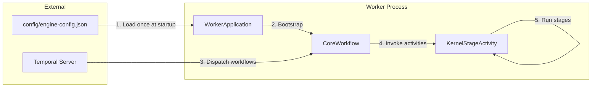
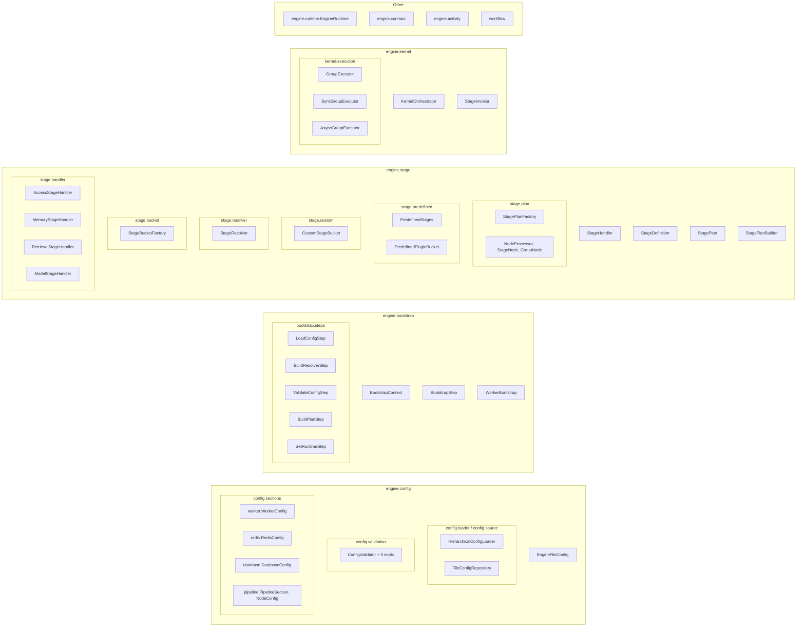
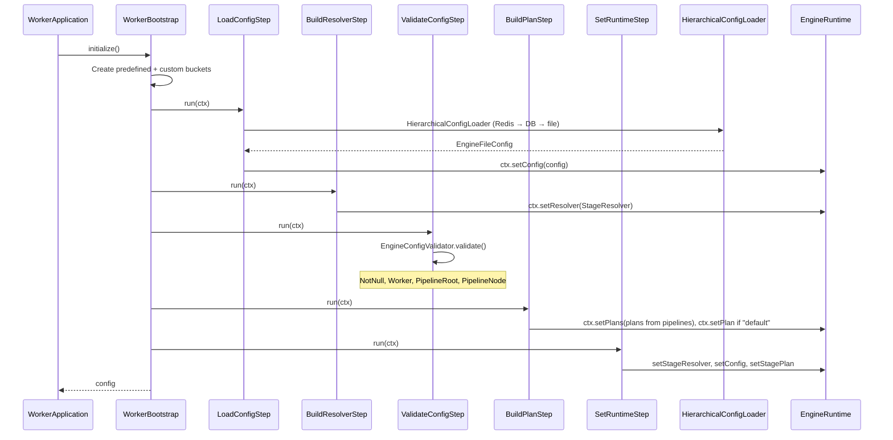
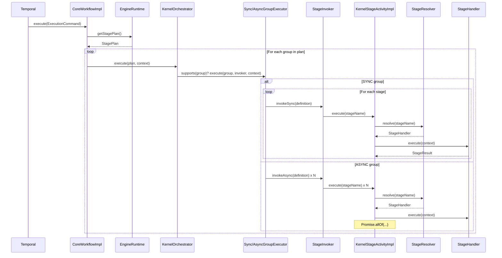
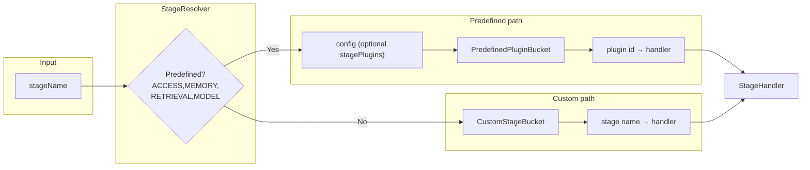
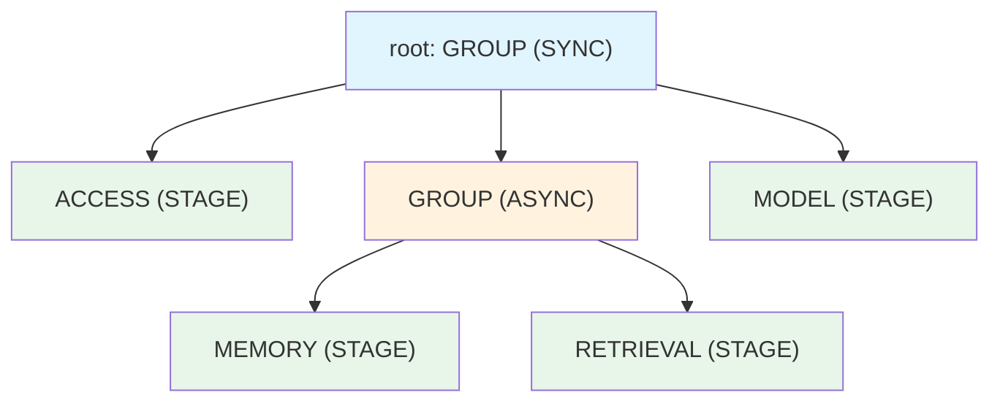

<!-- Copyright 2026 Open LLM Orchestrator contributors. Licensed under the Apache License, Version 2.0; see LICENSE file. -->

# Open LLM Orchestrator Worker — Architecture

High-level architecture and package layout for the worker engine.

---

## 1. System Context

- **Temporal** drives workflows and activities.
- **Config file** is loaded once at bootstrap; pipeline is recursive (GROUP/STAGE tree).
- **Worker** runs workflows and activities on the configured task queue.

---

## 2. High-Level Components

---

## 3. Package Structure (Small Packages, Single Responsibility)

---

## 4. Bootstrap Flow (One-Time)

---

## 5. Workflow Execution Flow (Per Run)

---

## 6. Stage Resolution (Predefined vs Custom)

- **Predefined stages** (ACCESS, MEMORY, RETRIEVAL, MODEL): plugin id from config (optional `stagePlugins`) or default, then lookup in `PredefinedPluginBucket`.
- **Custom stages**: any other name is resolved only from `CustomStageBucket`. If missing, the stage fails with a clear error.

---

## 7. Pipeline Config Shape (Recursive)

- **GROUP** = container; `executionMode`: SYNC (sequential) or ASYNC (parallel).
- **STAGE** = leaf; `name` must match a predefined stage (with plugin in config) or a custom stage (registered in custom bucket).

---

## 8. Design Principles

| Principle | How it’s applied |
|-----------|-------------------|
| **Small packages** | One clear responsibility per package (e.g. `config.loader`, `config.validation`, `stage.plan`, `stage.resolver`). |
| **Open/Closed** | New behaviour via new classes: new `ConfigValidator`, `NodeProcessor`, `GroupExecutor`, `BootstrapStep`; existing code unchanged. |
| **No reflection** | Stages and plugins are registered at bootstrap; resolution is map lookup and direct invocation. |
| **One-time config** | Config loaded once from file; recursive validation; plan and resolver built once and stored in `EngineRuntime`. |
| **Pluggable stages** | Predefined stages use config-driven plugin id; custom stages use a separate bucket; both fail clearly if unresolved. |

---

## 9. Key Files Quick Reference

| Concern | Location |
|--------|----------|
| Config file path | `config/engine-config.json` or `-Dengine.config.path` |
| Root config | `engine.config.EngineFileConfig` |
| Load config | `engine.config.loader.HierarchicalConfigLoader` (sources: Redis, DB, file) |
| Validate config | `engine.config.validation.EngineConfigValidator` |
| Build plan from pipeline | `engine.stage.plan.StagePlanFactory` |
| Resolve stage → handler | `engine.stage.resolver.StageResolver` |
| Default stage handlers | `engine.stage.handler.*` |
| Bootstrap entry | `engine.bootstrap.WorkerBootstrap` |
| Runtime state | `engine.runtime.EngineRuntime` |
| Workflow entry | `workflow.impl.CoreWorkflowImpl` |
| Activity entry | `engine.activity.impl.KernelStageActivityImpl` |
